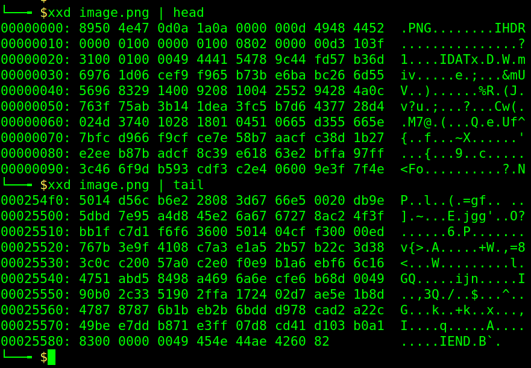

# Section-2 (Image Forensics)

## File Signatures

It stores the information about type of file or some specific features of file. This is also called ***file headers***. 

### Chunks

Chunks are fragments of information. These are used to read the file. Every application used to open a file has a decoder. It checks with the type of chunks and throws the error ***"Unsupported File Format"*** if the chunk is unknown.
This is an example for ***PNG*** image data.

#### Some chunks in PNG
Here as we can see, the first chunk is ***IHDR***. It stores information about the dimensions of image, bit depth, color type etc

The next important chunk is ***IDAT***. The value of the IDAT chunk stores the output datastream of the compression algorithm.
The image viewer decompresses the IDAT chunk content to get the image pixel values.

At the end, there is ***IEND***. It represents the end of the image data. It should appear at end and it's data field is empty.

The above three chunks are present in every png image. If any of the above chunk is missing in the image, the image viewer will give an error.

## Image Compressions

Images are stored after running a compression algorithm on image data. This helps to store large number of images. 
Various image file types like .jpg, .jpeg, .png, .svg etc. use different compression algorithms.
The compression algorithms can be largely classified in following 2 ways:

### Lossless Compression

As the name suggests, there is no loss of data in the compression. A ***PNG*** image file uses lossless compression. It's advantage is that there is no loss of quality if we open and save the image again and again.

### Lossy Compression

In lossy compression, it involved loss of information from original file when data is compressed. ***JPEG*** is a lossy compression. Each time image is opened and saved, there is some loss of data.

## LSB

LSB stands for ***Least Significant Bit***. We know that the data is stored in binary. 
Let's consider RGB images. The values of the numbers in the channels are between 0 and 255. This corresponds to 8 bits or 1 byte.

Changing the last bit (the least significant one) in the colour values of any pixel won't create much difference in how the image looks(it's just a 1 in 255). One can store some data in that series of bits in binary format.

This fact is used in ***Lossy Compressions***. The lower bits are changed while doing compression for more compression.
This doesn't change much how the image looks but the storage space reduces.

## Image Manipulation

***Pillow*** is a python library that can be used for image manipulation.
Earlier, ***PIL*** or ***Python Imaging Library*** was used but it's support was discontinued. After that, `Pillow` was announces the replacement for `PIL`.
One can store various kinds of data in an image by manipulating it using `Pillow`. Here is the link to the [documentation](https://pillow.readthedocs.io/en/stable/) of the `Pillow` library for complete details. Doing [this](https://pillow.readthedocs.io/en/stable/handbook/tutorial.html#using-the-image-class) should be enough for now but you can always use google and documentation for more details.

Discussions among mentees are encouraged and we request you to use the corresponding Team on MS Teams or the corresponding WhatsApp group for the same.

    Created with ❤️ by <a href="https://github.com/CSecIITB">CSeC</a>

